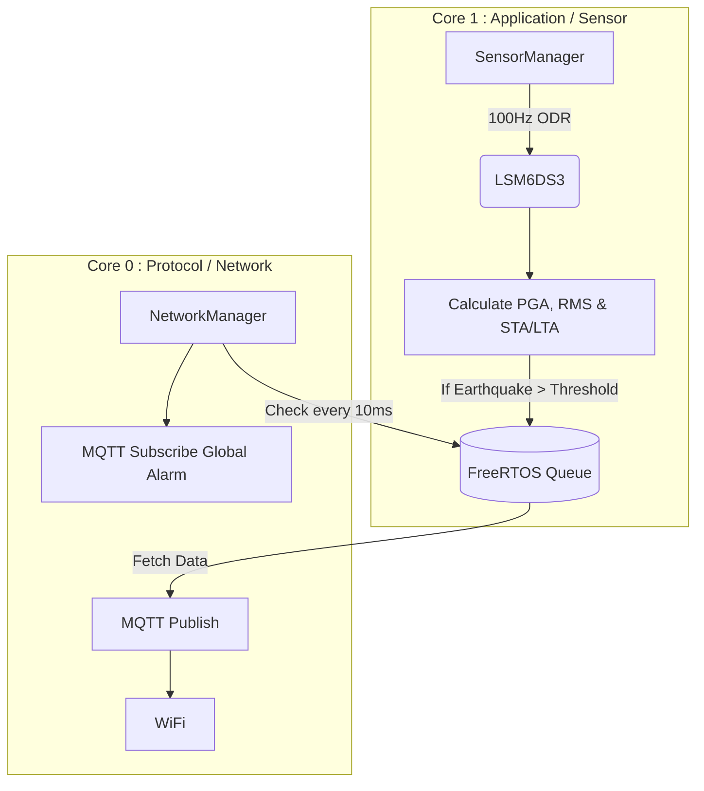

<!-- START OF 04_HARDWARE.md -->
# 🔧 Hardware Specification — Lindu.id

## Bill of Materials (BOM)

### Per Sensor Node (×2)

| No | Component | Specification | Qty | Estimated Price |
|----|-----------|---------------|-----|-----------------|
| 1 | ESP32 Dev Board | ESP32-WROOM-32 or XIAO ESP32 | 1 | Rp 120.000 |
| 2 | IMU Sensor | LSM6DS3 / LSM6DSO breakout board (Calculates gravity vector/pose for flat/wall mounting) | 1 | Rp 80.000 |
| 3 | Buzzer | 5V Active buzzer | 1 | Rp 5.000 |
| 4 | LED | 5mm Red LED + 220Ω resistor | 2 | Rp 2.000 |
| 5 | OLED Display | 0.96" SSD1306 I2C (optional) | 1 | Rp 30.000 |
| 6 | Power Supply | 5V 1A adapter + micro USB | 1 | Rp 25.000 |
| 7 | UPS Module | TP4056 + LiPo 3.7V 2000mAh + 5V step-up | 1 | Rp 80.000 |
| 8 | PCB/Breadboard | Prototype PCB or breadboard | 1 | Rp 15.000 |
| 9 | Enclosure | IP54 Project box | 1 | Rp 40.000 |
| **Total** | | | | **~Rp 397.000/node** |

### Actuator Node (×1)

| No | Component | Specification | Qty | Estimated Price |
|----|-----------|---------------|-----|-----------------|
| 1 | ESP32 Dev Board | ESP32-WROOM-32 / ESP32-DevKitC | 1 | Rp 80.000 |
| 2 | Solenoid Door Lock | 12V DC fail-secure / fail-safe | 1 | Rp 150.000 |
| 3 | Servo Motor | MG996R / SG90 (for small valve) | 1 | Rp 35.000 |
| 4 | Relay Module | 2-channel 5V relay | 1 | Rp 20.000 |
| 5 | Buzzer | 12V Active buzzer | 1 | Rp 10.000 |
| 6 | LED Strobe | 12V Red LED strobe | 1 | Rp 30.000 |
| 7 | Power Supply | 12V 2A + 5V 1A dual output | 1 | Rp 60.000 |
| 8 | UPS Module | 12V 7Ah SLA battery + charger | 1 | Rp 200.000 |
| 9 | Enclosure | IP55 Panel box | 1 | Rp 80.000 |
| **Total** | | | | **~Rp 665.000** |

### Server Hardware (VPS / Cloud)

| Component | Minimum Specification | Recommended Specification |
|-----------|-----------------------|---------------------------|
| CPU | 2 vCPU | 4 vCPU |
| RAM | 2 GB | 4 GB |
| Storage | 20 GB SSD | 50 GB SSD |
| Bandwidth | 100 Mbps | 1 Gbps |
| OS | Ubuntu 22.04 LTS | Ubuntu 22.04 LTS |
| Domain | lindu.id (Rp 150.000/year) | mqtt.lindu.id (free subdomain) |

---

## Wiring Diagram

### Sensor Node — ESP32 + LSM6DS3

```
ESP32                   LSM6DS3
────────               ─────────
3.3V      ──────────►  VCC
GND       ──────────►  GND
GPIO 8 (SDA) ───────►  SDA  (I2C)
GPIO 9 (SCL) ───────►  SCL  (I2C)
GPIO 4    ──────────►  INT1 (Vibration interrupt)

ESP32                   Buzzer
────────               ────────
GPIO 12   ──► 220Ω ──► + (Buzzer)
GND       ──────────►  - (Buzzer)

ESP32                   Red LED
────────               ──────────
GPIO 13   ──► 220Ω ──► Anode (+)
GND       ──────────►  Cathode (-)

ESP32                   OLED SSD1306 (optional)
────────               ────────────────────────
3.3V      ──────────►  VCC
GND       ──────────►  GND
GPIO 8 (SDA) ───────►  SDA  (Shared I2C)
GPIO 9 (SCL) ───────►  SCL  (Shared I2C)
```

### Actuator Node — ESP32 + Actuator

```
ESP32                   Relay Module
────────               ─────────────
5V        ──────────►  VCC
GND       ──────────►  GND
GPIO 26   ──────────►  IN1 (Solenoid door relay)
GPIO 27   ──────────►  IN2 (Buzzer strobe relay)

Relay Module            Solenoid Door Lock
─────────────          ───────────────────
COM       ──────────►  + (12V)
NO        ──────────►  (wire to solenoid)
                       - ──────────► GND 12V

ESP32                   Servo Motor (Gas Valve)
────────               ──────────────────────
5V        ──────────►  VCC (red)
GND       ──────────►  GND (brown/black)
GPIO 25   ──────────►  Signal (orange/yellow)

ESP32                   LED Strobe
────────               ───────────
GPIO 14   ──────────►  Signal/Trigger
```

---

## LSM6DS3 — Seismic Configuration

### Optimal Register Settings

| Parameter | Setting | Value |
|-----------|---------|-------|
| ODR Accelerometer | 1666 Hz (1.6 kHz) | `CTRL1_XL = 0x80` |
| Full Scale Accel | ±8g | `CTRL1_XL[3:2] = 11b` |
| ODR Gyroscope | 1666 Hz | `CTRL2_G = 0x80` |
| Full Scale Gyro | 500 dps | `CTRL2_G[3:2] = 01b` |
| Low Pass Filter | 400 Hz cutoff | LPF2 enabled |
| FIFO | Mode: FIFO, 512 samples | Anti-alias |
| Wake-up Threshold | ~0.05g | `WAKE_UP_THS = 0x02` |
| INT1 | Wake-up interrupt | `MD1_CFG = 0x20` |

### Gravity Vector & Pose Calculation
The device uses the LSM6DS3 to calculate the gravity vector, which determines the pose for either flat or wall mounting. This allows the node to automatically correct its axes based on how it is mounted, ensuring accurate seismic readings regardless of its physical orientation.

### STA/LTA Algorithm (Short-Term Average / Long-Term Average)

Standard seismology algorithm for wave onset detection:

```
STA = mean(|x[t-STA_window:t]|)    # Short window: ~1 second
LTA = mean(|x[t-LTA_window:t]|)    # Long window: ~30 seconds
Ratio = STA / LTA

if Ratio > THRESHOLD (usually 3-5):
    → P-wave onset detected!
```

---

## Power & Fail-Safe UPS (Mandatory)

**Disaster Scenario:** Earthquakes almost always cut off the city's power grid (fallen poles/exploding transformers) *seconds* before the deadly S-Wave hits buildings at full force. If your device shuts down due to power loss, it **fails to save lives**. Therefore, a backup power module is **Mandatory**, not optional.

### Sensor Node UPS (Supercapacitor / LiPo)

```
AC 220V ──► [5V Adapter] ──► [ESP32 VCC + Sensor]
                          └──► [TP4056 Charger] ──► [LiPo 3.7V 2Ah]
                                                     │
[LiPo 3.7V 2Ah] ──► [MT3608 Step-up 5V] ──────────┘ (automatic on AC loss)
```

**Battery Life Estimation:**
- Active ESP32: ~150mA @ 3.3V ≈ 0.5W
- LSM6DS3: ~5mA ≈ 0.016W
- LED + Buzzer (standby off): ~0mA
- **Total: ~155mA @ 5V**
- **LiPo 2000mAh ÷ 155mA ≈ 12.9 hours** ✅ (target ≥4 hours met)

### Actuator Node UPS

```text
AC 220V ──► [12V 2A Adapter] ──► [12V Actuators]
                              └──► [SLA 12V 7Ah charger]
[SLA 12V 7Ah] ──────────────────► (automatic on AC loss)
```

**Battery Life Estimation:**
- ESP32: ~1W
- Solenoid (energized): ~6W (only when active)
- Servo (standby): ~0.5W
- **Total Standby: ~1.5W, 12V SLA 7Ah (84Wh) ≈ 56 standby hours** ✅

---

## ⚡ Electrical Safety & Component Protection (Mandatory)

To ensure the device runs stably 24/7 without sudden restarts (*brownouts*) or microcontroller pin damage (*fried GPIO*), the circuit must use the following passive protection components:

1. **LED Protection (Current Limiting)**
   - Must use a **220Ω or 330Ω Resistor** in series with the LED. Without it, the LED will draw over 40mA, slowly burning the ESP32 GPIO pin from the inside.
2. **Inductive Load / Buzzer Protection (Transistor Switch)**
   - Loud active buzzers (especially 5V/12V) MUST NOT be powered directly from ESP32 GPIO pins.
   - Use an **NPN Transistor (2N2222 or BC547)** as an electrical switch. The ESP32 GPIO pin only sends a small signal via a 1KΩ Resistor to the transistor's Base.
3. **Anti-Brownout Protection (Decoupling Capacitor)**
   - Servo Motors and Solenoids will draw sudden spikes of current when starting to move. This causes a voltage drop that forces a sudden ESP32 *restart*.
   - **Solution:** Install a **470µF or 1000µF / 16V Electrolytic Capacitor (Elco)** in parallel across the `5V` and `GND` rails on the PCB. The capacitor acts as a "backup power tank" to supply these sudden current spikes.
4. **LSM6DS3 I2C Lines (Pull-Up Resistors)**
   - No need to add external *Pull-Up* resistors (4.7kΩ). Commercial LSM6DS3 *breakout board* modules already have integrated Surface-Mount (SMD) resistors on the SDA and SCL pins.

---

## 🚦 User Interface (LED & Buzzer Mapping)

Since the device lacks an LCD screen (for power efficiency), system status communication relies on Light Indicators (*LEDs*).

| Device Status | 🔵 System LED (GPIO 2) | 🔴 Danger LED (GPIO 13) | 🔊 Siren (GPIO 12) | Meaning to User |
| :--- | :--- | :--- | :--- | :--- |
| **Setup (Captive Portal)** | 🟡 Fast Blink (0.5s) | ⚫ Off | 🔇 Muted | Device requesting Wi-Fi & GPS *setup* via Phone. |
| **Normal (Connected)** | 🟢 Solid On | ⚫ Off | 🔇 Muted | Device 100% Active, connected to Cloud Server. |
| **Offline (Internet Down)** | 🟡 Slow Blink (3s) | ⚫ Off | 🔇 Muted | Guarding locally. (Failed to connect to Server). |
| **EARTHQUAKE ALARM!** | 🟢 (Ignore) | 🔴 **RAPID STROBE** | 🔊 **LOUD ALARM** | Earthquake Danger! Evacuate! |

---

## Placement Recommendations

### Sensor Node
- **Elevation**: Place on low floor / wall (not on a floating table)
- **Surface**: Rigid mount to building structure (concrete/steel), NOT wood/furniture
- **Anti-vibration**: DO NOT place near engines, AC units, or washing machines
- **Distance between nodes**: Minimum 10 meters, ideally 50-200 meters for triangulation
- **Orientation**: Uses LSM6DS3 gravity vector for flat/wall pose calculation

### Actuator Node
- **Gas Valve**: Near main gas meter, easy access for servo
- **Door Lock**: On emergency door / main building door
- **Panel box**: On wall, easily accessible for manual override


---

<!-- START OF 12_FIRMWARE_BLUEPRINT.md -->
# 📐 Lindu.id — Firmware & Server Code Blueprint

> This document locks the code structure (Class & Interface) for ESP32 (C++) and Server (Python). The purpose of this document is to serve as a strict reference during the coding execution phase, minimizing refactoring and saving tokens.

---

## 1. ESP32 Firmware Architecture (C++ / PlatformIO)

**Core Principle:** Non-blocking, EMA-based Math, FreeRTOS Message Queues.

### 1.1 Task & Core Assignment (ESP32-S3 Dual Core)
- **Core 0 (Protocol / Network Task):** WiFiManager, MQTT Reconnect, MQTT Subscribe, Queue Consumer.
- **Core 1 (Application / Sensor Task):** I2C Sensor Polling (100Hz), STA/LTA Math, Queue Producer.

### 1.2 FreeRTOS Dual-Core Architecture



### 1.3 Class Blueprint (As Implemented)

```cpp
// 1. Inter-Core Communication Struct (FreeRTOS Queue)
struct SensorEvent {
    float pga;
    float rms;
    float ratio;
};

// 2. Config & NVS Manager
class ConfigManager {
public:
    void begin();
    void loadConfig(); // Fetch ID from ESP.getEfuseMac()
    void saveConfig(); 
    bool startCaptivePortal(); // WiFiManager (3-minute timeout)
};

// 3. I2C Sensor (Runs on Core 1)
class SensorManager {
public:
    void begin(QueueHandle_t queue);
    void loop(); // 100Hz ODR, DC Offset Removal, ZCR Filter, STA/LTA Math
    bool selfTest(); // Verify hardware WHO_AM_I register
private:
    // State variables for Gravity Calibration (Dynamic DC Offset)
    // State variables for Zero-Crossing Rate (ZCR) / Frequency Counter
    String pose; // "Flat" or "Wall"
    float tilt_angle;
};

// 4. Network, MQTT & OTA (Runs on Core 0)
class NetworkManager {
public:
    void begin(ConfigManager* configMgr);
    void loop(); // Non-blocking Reconnect (10s interval) & ArduinoOTA.handle()
    void publishEvent(float pga, float rms, float ratio);
    float haversine(float lat1, float lon1, float lat2, float lon2); 
    void setupLastWillAndTestament();
    // Using WiFiClientSecure for TLS 1.2 (Port 8883)
};
```

---

## 2. Server Architecture (Python / FastAPI)

**Core Principle:** Async, Event-Driven, Edge Computing Support.

### 2.1 Component Blueprint

```python
# 1. Models (Pydantic)
class NodeReading(BaseModel):
    node_id: str
    pga_g: float
    rms_g: float
    sta_lta_ratio: float

# 2. Database UPSERT Logic (Node Registration)
# Server no longer provisions IDs. 
# Node sends status with Efuse MAC ID, Server directly UPSERTs into PostgreSQL (Dockerized).
class DatabaseManager:
    def upsert_node(self, node_id: str, lat: float, lon: float, pose: str, tilt_angle: float):
        pass

# 3. Global Broadcast Engine (Edge Computing Support)
class AlertEngine:
    def trigger_eew(self, epi_lat: float, epi_lon: float, radius_km: float):
        # Broadcast to lindu/actuator/cmd/all
        # Let ESP32 (Edge) calculate Haversine distance independently
        pass
```

---

## 3. Industry Insight: Comparison with "GeoShake" (Open-Source Seismometer)

After conducting an audit on the industry repository [GeoShake](https://github.com/GeoShake/geoshake), here is their architecture and how it compares to our Lindu.id system:

| Feature / Parameter | Lindu.id (Our Current System) | GeoShake (T1 Rev-C) | Lessons for V2 (Commercial) |
| :--- | :--- | :--- | :--- |
| **Framework** | Arduino C++ | ESP-IDF (Native C) | Arduino suffices for MVP. V2 can migrate to ESP-IDF. |
| **Sensor & Bus** | 1x LSM6DS3 (I2C) | 4x LSM6DSO (SPI) | GeoShake uses 4 sensors simultaneously in 1 device for anti-false alarm *voting*. |
| **Waveform Processing** | EMA (O(1) Memory, extremely lightweight) | Ring Buffer (6.5 seconds waveform) | Our EMA is more RAM-efficient. GeoShake stores full waveform graphics for scientists. |
| **Provisioning** | WiFi Captive Portal (WiFi + Manual GPS) | BLE (Bluetooth Low Energy) | MVP uses an independent *Captive Portal*. Users manually input *Lat/Lon* from Google Maps without relying on an external server. |
| **System Update** | **OTA A/B Rollback (Hardcoded URL)** | Signed OTA RSA-3072 + A/B Rollback | Our MVP **avoids RSA-3072** so developers don't risk burning eFuse (bricking). Instead, we use a *Hardcoded Base URL* for Anti-Spoofing. |
| **Dashboard UI** | **Geoshake-style UI** (Animated epicenters, PGA-based color-coded nodes, Helicorder 24h mockup, RMS & PGA metrics, Node Detail Modals) | Advanced Analytics Dashboard | Our React Dashboard adopts the intuitive Geoshake-style visualization. |

**Execution Conclusion:** The newly built Lindu.id system (EMA, FreeRTOS, Haversine Edge, **MQTTS TLS**, **PostgreSQL (Dockerized)**, and **OTA Rollback with Hardcoded URL**) has proven equivalent to factory (Enterprise) standards without compromising circuit board safety during testing. It is excellent for a thesis prototype. For the next iteration (Mass Production), we will consider activating *Hardware Secure Boot* (eFuse) and GeoShake's **4-Sensor SPI (Quad Redundancy)** tactics to eliminate local mechanical *false-positives*.


---
